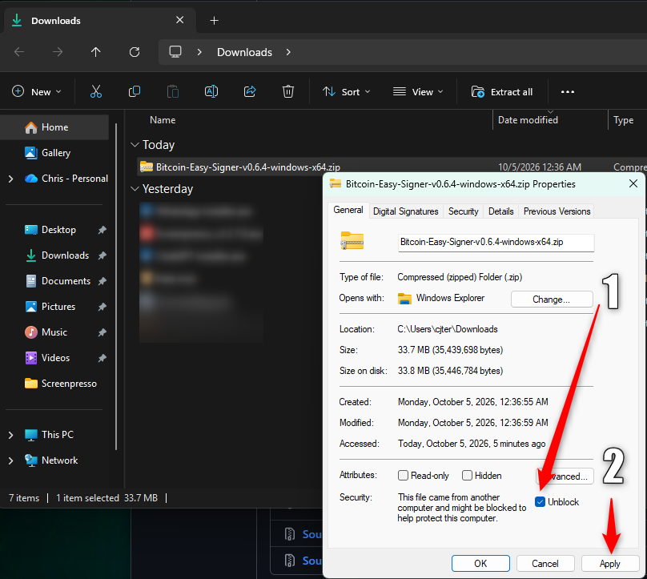

# Bitcoin Easy Signer

PROJECT HOMEPAGE: https://bitcoineasysigner.com/ (GitHub Pages with HTTPS)

**Latest published version: 0.6.4** — [all releases: macOS (Apple silicon), Windows x64, source](https://github.com/cjtsh/bitcoin-easy-multisig-signer/releases). This process and test release adds API regression coverage, records the vendored embit wheel hash in the SBOM, and establishes the audited candidate-to-publication workflow. Local builds remain available for quick development iterations; every public release must use the GitHub workflow, and manual publication is prohibited. Version 0.6.4 changes no wallet, transaction, signing, finalization, or broadcast behavior. The dated [AI-generated Z.ai review of v0.6.4](releases/AUDIT-ZAI-0.6.4.md) assigns Green under its published rubric after verifying the automated release path. It is evidence about one revision and its stated coverage, not a certification or guarantee; no independent human end-to-end security review is recorded. The earlier [v0.6.3 report](releases/AUDIT-ZAI-0.6.3.md) records its historical Yellow grade because that release bypassed the automated publish gates. The app opens on Bitcoin mainnet, with practice networks behind developer mode. Mainnet broadcast requires one explicit per-transaction confirmation on the final screen and a backend opt-in that fails closed when omitted. One earlier mainnet transaction was confirmed on chain; that does not establish that a later one is safe. Bitcoin Easy Signer is free, open-source software maintained and distributed by Bitseeker LLC, with no warranty or guarantee to the fullest extent allowed by law. Read [the safety and responsibility notice](DISCLAIMER.md). The [plain-language user manual](USER-MANUAL.md) walks a spouse, trustee, lawyer, accountant, or family member through recovery.

Bitcoin Easy Signer helps a spouse, estate professional, or other nontechnical person send Bitcoin from an **existing** native-SegWit multisig wallet with two or three keys. The wallet definition determines its signing threshold. The app does not create a wallet, generate keys, or ask for seeds or PINs. The intended screen is simple: open the wallet definition, see the balance, enter a destination, review the payment, approve it on the required hardware devices, and confirm the final transaction.

Standing cautions that survive across versions: Mutinynet needs a funded BSMS wallet, and existing Testnet4 coins cannot move between networks. Very old installed builds (0.2.1) could show stale signing/final details when a new payment was prepared; **never broadcast from a screen that mixes two payments** — close the old app and install the current release. Never send a sweep to work around a missing change path, and never sweep a real wallet merely to test Send All.

## Windows and Linux: opening the app

Download the file for your computer from the [release page](https://github.com/cjtsh/bitcoin-easy-multisig-signer/releases).

### Windows

**Unblock the ZIP before extracting it.** Otherwise Windows can block a bundled library and the app may report `Failed to resolve Python.Runtime.Loader.Initialize`.

1. Right-click the downloaded Windows ZIP and select **Properties**.
2. Check **Unblock**, then click **Apply** and **OK**. If Unblock is not shown, continue.
3. Right-click the ZIP and select **Extract All**.
4. Open the extracted folder, then the **Bitcoin Easy Signer** folder, and double-click **Bitcoin Easy Signer.exe**.



Already extracted it and received the startup error? Close the app, unblock the original ZIP, and extract it again into a fresh folder. Run the EXE from that new folder. Keep the EXE together with its extracted files.

The Windows build is unsigned. If SmartScreen appears, select **More info**, then **Run anyway** after verifying you downloaded the release from this repository.

### Linux

**The Linux app opens in your default web browser.** This is expected: the launcher runs the app locally and opens its interface in a browser tab.

Make the downloaded **AppImage** executable and run it. For the **tar.gz** download, extract it and run **./run-me.sh**. Keep the launcher running while using the browser interface.

## What this version does

- Imports a BSMS 1.0 definition for a native-SegWit multisig wallet with two or three keys. It follows the quorum in the file, for any valid threshold, and checks the reference receive address, public cosigner identities, and selected network.
- Scans receive and established change branches through a selected Esplora server. A gap-limited scan is an observation, not proof of a complete balance. Derived addresses are disclosed to that server after consent; seeds and private keys remain on hardware.
- Builds a PSBT from confirmed, independently checked previous outputs. Partial sends use a BSMS-declared change branch or the strict BIP48 standard `/1/*` branch for an anchored 2-of-3 native-SegWit sorted wallet. The latter is labelled as standard-derived, since the BSMS does not explicitly declare it. Hardware signers usually do not display change addresses, so verify change in the wallet software that holds this wallet file. If neither route applies, the owner can explicitly choose **Send All confirmed outputs found by the scan**, producing no change.
- Checks connected hardware signers through bundled Bitcoin Core HWI, asks them to sign, and shows **one box per cosigner** so the missing signer is visible at a glance rather than described in a sentence. Retains only signatures that verify against the reviewed transaction, and discards all returned wallet metadata before finalization. Each device must display the destination, amount and fee, and the person using the app must check that screen. Signers commonly hide the change output, which must be checked separately.
- Shows the destination, amount, network, every change output, fee, effective fee rate, and transaction ID together at the final confirmation. Every network requires a separate explicit broadcast confirmation. Mainnet is labelled real Bitcoin and the backend independently requires its mainnet opt-in flag.
- Shows what it is doing while it waits: a fixed progress bar with a spinner and **elapsed seconds**, so a slow step is visibly working rather than apparently frozen. A one-line note explains that steps talk to the network and to hardware devices and can take a few seconds. **No wait duration is ever advertised** — the internal timeouts exist so a slow human is never cut off mid-review, and publishing one would read as permission to walk away during a signing ceremony. Each signature fills its box as soon as it verifies, without waiting for the next device search. The bar belongs to **one operation at a time**: an operation that has finished cannot clear or overwrite the message of one still running, so a stale device prompt cannot appear during a balance check.
- After an outgoing payment is accepted, shows a prominent notice that it is waiting for one confirmation and offers **Check again**. Another payment from that wallet is paused until the refreshed explorer state confirms it. Pending incoming funds alone do not pause confirmed outputs.
- In 0.4.0, after that confirmation the app keeps a visible explorer-link receipt for the latest payment in the current browser session. It is cleared when opening a different wallet or changing networks and is not long-term transaction history.
- Can save an unsigned PSBT and, on request, a privacy-limited diagnostic report in Downloads. The report has fixed pass/fail codes and timestamps, without wallet identifiers, balances, transaction bytes, or device paths.

The app uses **one** wallet/PSBT/signing engine. [`network_config.py`](network_config.py) supplies the selected network's address prefix, BIP48 coin type, Esplora endpoint, genesis hash and any custom-Signet checkpoint. A mainnet wallet uses BIP48 coin type `0'`, while both practice networks use `1'`; each network needs its own correct wallet definition and coins. `gui.py` retains explicit mainnet safety gates; there is no separate mainnet transaction implementation.

## Practice networks and developer mode

This app exists to move **real** Bitcoin out of an existing multisig wallet. It is not a testnet tool, and the person it is written for — a spouse, an executor, an accountant — will never need a practice network. Reaching Mutinynet or Testnet4 is therefore behind a deliberate step rather than sitting on the opening screen.

The app opens on **Bitcoin mainnet**. A button at the top of the opening screen, **Enter Developer Mode**, explains that you are leaving live Bitcoin and, on confirmation, reveals the network cards and switches to Mutinynet. The cards it reveals are the two practice networks: live Bitcoin is what the **Return to Bitcoin** button goes back to, not a choice inside the panel, so the gate cannot leave the app on mainnet while it still calls itself developer mode. **Mutinynet is the default practice network**, because a default has to be chosen, and its blocks come quickly; Testnet4 remains available for a wallet that already holds Testnet4 coins.

This is a genuine test bench, and developers are welcome to use it. You can point the app at a practice wallet file and walk the whole path — import, scan, build, sign on real hardware, review, broadcast — against coins that cost nothing. It is easy to use this way, and a practice run is the right way to learn the interface before touching a real wallet.

What it will not do: the app cannot fund a practice wallet, and it cannot give you practice coins. A practice wallet needs its own BSMS file and its own coins, obtained elsewhere. Leaving developer mode and returning to Bitcoin does not touch your real Bitcoin. A payment sent to the wrong network cannot be undone by this app.

The selected network is kept **in memory for the current session only**. The app does not write it to any settings file, so reopening the app always returns to live Bitcoin — a practice network can never be left switched on by accident. While a payment is prepared, the gate refuses to change network and says why. The orange or green frame around the window and the network badge are always visible and always name the network actually in force: orange means real Bitcoin, green means practice coins. Those two signals cannot be hidden or disagree.

Developer mode is part of the current **0.6.4** download. The older published 0.5.1 build keeps the network cards on the opening screen.

## Mac installation and one-session test

The app does not check for updates automatically. Check the GitHub releases
page manually before a new recovery session and install the current signed
release.

The published 0.6.4 DMG is for Apple Silicon, signed with Bitseeker LLC's Developer ID, notarized by Apple, and stapled. It is byte-identical to the successful workflow candidate. The release includes `BUILD-SBOM.json` and `SHA256SUMS`; verify downloads against those checksums before opening them. macOS may still show its ordinary first-open confirmation for downloaded software; do not disable Gatekeeper globally.

Physical-use evidence is owner-reported: two Mutinynet sends on 0.3.2, a confirmed Ledger + Jade Mutinynet payment on 0.4.1, the first live mainnet payment on the 0.5.0 candidate, and a successful Mutinynet payment with the exact 0.6.3 DMG. The 0.5.0 payment was signed by an OneKey Classic 1S (through HWI's Trezor backend) and a Ledger Nano S and confirmed on chain; its transaction engine was published unchanged in 0.5.1. The 0.6.3 privacy-limited diagnostic recorded verified signatures, finalization, and accepted broadcast, but confirmation was not independently checked in that acceptance step. The 0.4.13 appearance changes were not separately exercised in a physical transaction walkthrough. On each hardware device, check the destination, amount and fee. Signers commonly hide the change output, so check the change address in your own wallet software instead. Save the diagnostic report only if something fails or a reviewer needs evidence; the button is at the bottom of the window. Keep wallet files, xpubs, addresses, PSBTs, and raw signed transactions out of public issue reports and the repository.

If neither declared nor guarded standard change is available, the app offers a no-change Send All path. **Do not sweep a real wallet merely to test this feature.**

## Supported scope and limitations

| Item | Published support (0.6.4) |
| --- | --- |
| Wallet | Existing BSMS 1.0, P2WSH multisig with two or three keys and xpub origins; threshold comes from the file |
| Networks | Testnet4, Mutinynet and mainnet through one engine. Mainnet broadcast requires one explicit per-transaction confirmation on the final screen plus a backend opt-in that fails closed when omitted. Before 0.5.0 every build refused a mainnet broadcast in code. From 0.6.1 the app opens on mainnet and reaches the practice networks only through developer mode, whose panel offers Mutinynet and Testnet4 and keeps live Bitcoin behind "Return to Bitcoin" |
| Hardware exercised | Jade, Trezor Safe 3, Ledger Nano S Plus — Testnet4 through 0.2.1; Mutinynet on 0.3.2 and 0.4.1. OneKey Classic 1S (HWI Trezor backend) and Ledger Nano S signed the first live mainnet payment on 0.5.0 |
| Distribution | Apple Silicon Developer ID-signed and notarized DMG, source archive; see the release assets and `SHA256SUMS` |
| Fees | Mainnet mempool.space guidance for mainnet/Testnet4; Mutinynet's Esplora reference in Mutinynet mode; 1–25 sat/vB and 10,000-sat estimated fee caps. No in-app fee bump |
| Scan | 20-address unused gap, at most 100 addresses per known branch; historical or unusual funds can be missed |
| Recovery | No built-in fee bump, no support for wallets with more than three keys or legacy address types |

## Developer and reviewer entry point

Read [`CURRENT-STATUS.md`](CURRENT-STATUS.md), [`AGENTS.md`](AGENTS.md), and [`PHASE-HANDOFF.md`](PHASE-HANDOFF.md) for current status, safety boundaries, and the next owner gate; every agent preparing a DMG must follow [`RELEASE-PROCESS.md`](RELEASE-PROCESS.md). Then read [`RELEASE-HISTORY.md`](RELEASE-HISTORY.md) for the version record and [`CHANGE-ADDRESS-REVIEW.md`](CHANGE-ADDRESS-REVIEW.md) for the BSMS change-path trust boundary. The [original audit](releases/AUDIT-BASELINE-0.1.27.md), the [0.2.0 fix record](releases/SECURITY-REVIEW-0.2.0.md), and [`PROJECT-HISTORY.md`](PROJECT-HISTORY.md) / [`ROADMAP.md`](ROADMAP.md) preserve earlier decisions and phase history. Two independent 0.4.3 audits are historical reviews of `main` at `7d622ef`; neither exercised a mainnet transaction or a physical device. Current behavior in source and tests takes precedence over historical descriptions and over any review's description of it.

The project is maintained by **Bitseeker LLC**. Read the [privacy notice](PRIVACY.md), [security reporting instructions](SECURITY.md), and [contribution terms](CONTRIBUTING.md) before sharing information or submitting changes. These project notices do not replace advice from a qualified attorney.

Use Python 3.12 for the Mac build (HWI 3.2.0 does not support 3.13+). Homebrew's keg ships `python3.12` and deliberately no `python3`, so name the interpreter:

```sh
PYTHON=python3.12 bash scripts/build-macos.sh <version>
```

Source tests:

```sh
python3.12 -m venv .venv
.venv/bin/python -m pip install --require-hashes -r requirements.lock
# PyYAML is only needed to lint the workflow itself. Without it the entire
# workflow-lint module skips itself, which looks exactly like a pass.
.venv/bin/python -m pip install --require-hashes -r requirements-ci.lock
.venv/bin/python -m unittest discover -s tests -q
```

The Mac build installs [`requirements-desktop.lock`](requirements-desktop.lock) with hashes. A reviewed `LIBUSB_SHA256` is mandatory. [`scripts/build-source.sh`](scripts/build-source.sh) creates the source archive; [`scripts/build-macos.sh`](scripts/build-macos.sh) creates the DMG on Apple Silicon. The GitHub workflow is **manual dispatch only**; see [`RELEASE-PROCESS.md`](RELEASE-PROCESS.md) for the required signed-candidate run followed by publication from the same commit through workflow gates. Every published version includes `BUILD-SBOM.json` and `SHA256SUMS`. Never republish under an existing version; use a new patch version for any correction to a published build.

## External components

- [embit](https://github.com/diybitcoinhardware/embit): descriptors, derivation, Bitcoin transactions and PSBTs.
- [Bitcoin Core HWI](https://github.com/bitcoin-core/HWI): hardware discovery and signing requests; no USB driver or private-key code is written here. **This dependency decides which devices are supported, which Python version the app builds on, and when a rebuild is mandatory** — see [`HWI-DEPENDENCY.md`](HWI-DEPENDENCY.md).
- [pywebview](https://pywebview.flowrl.com/): native Mac WebKit window over the loopback-only local app.
- [PyInstaller](https://pyinstaller.org/): bundled runtime and binaries.
- [Esplora](https://github.com/Blockstream/esplora): public address/UTXO/transaction API and practice-network broadcast endpoints.

These components do not remove the need to verify release provenance, wallet policy, signer display, and the final transaction.
