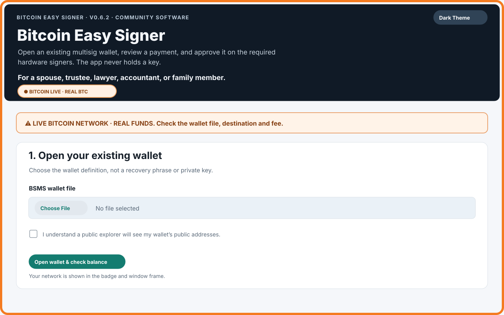
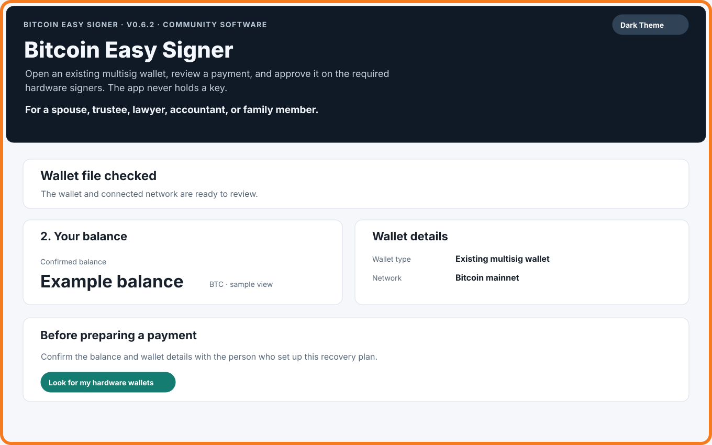
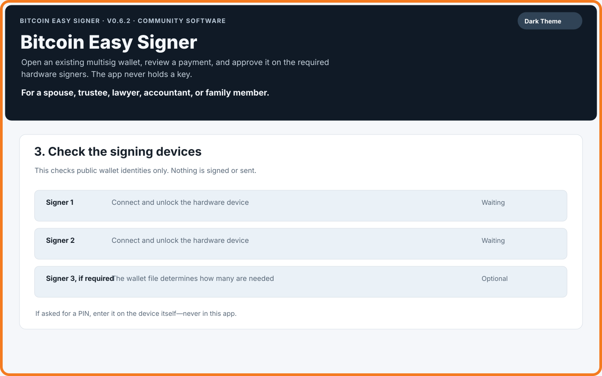
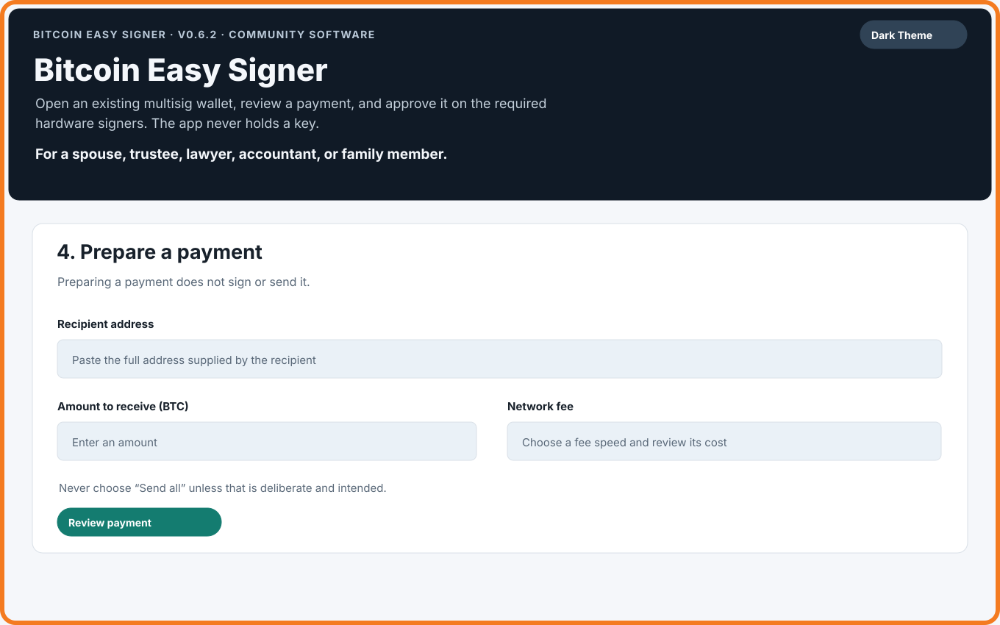
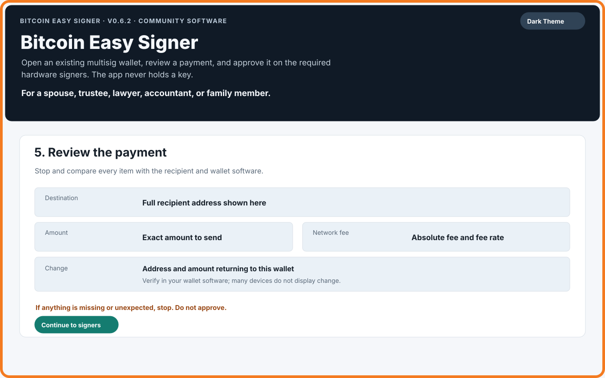
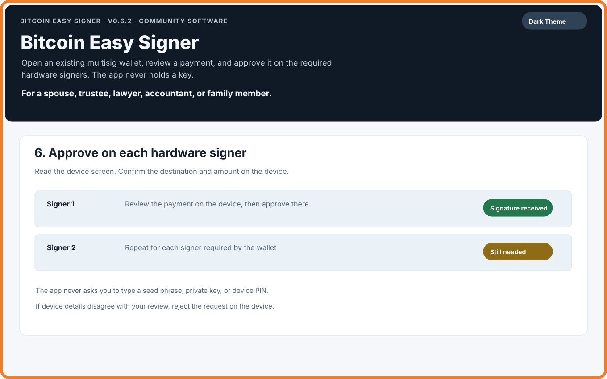
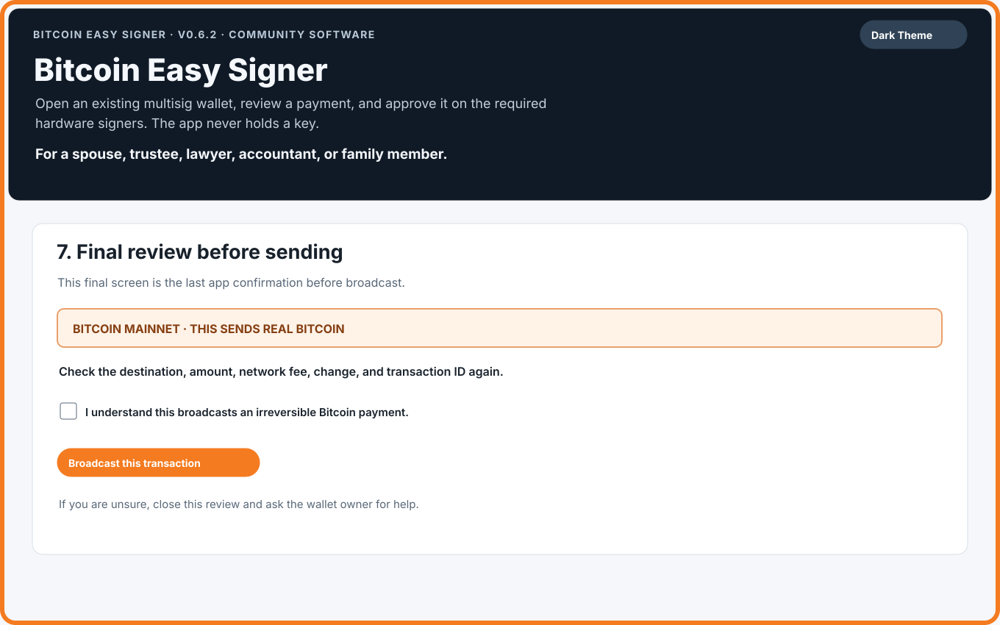
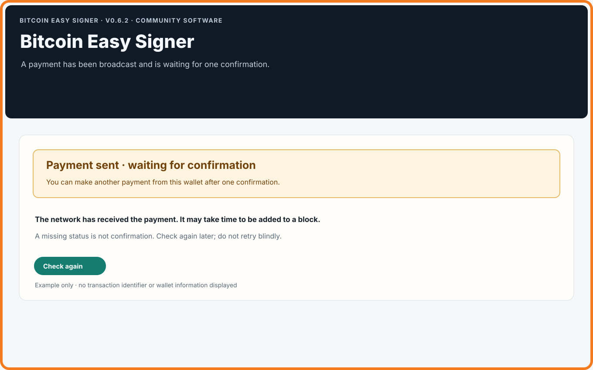
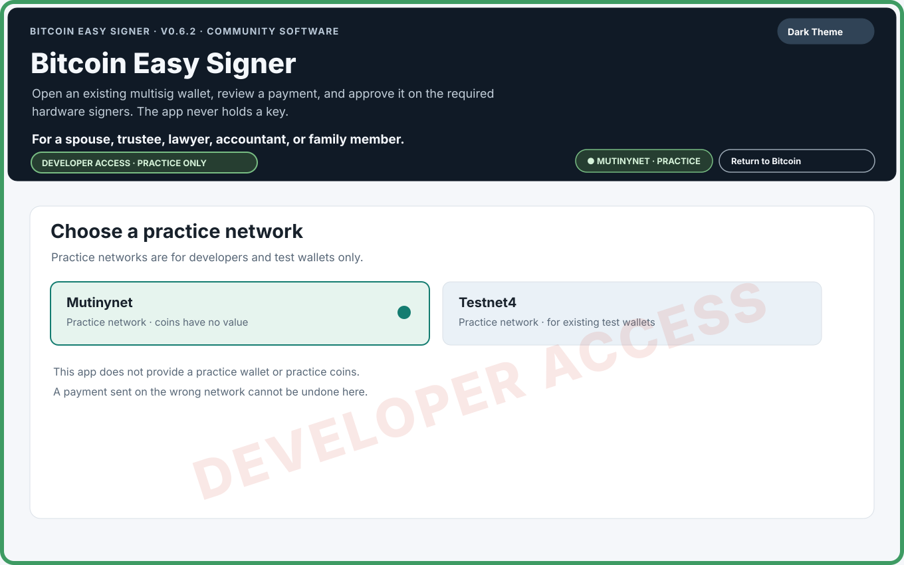

# Bitcoin Easy Signer — a guide for the person helping

**For a spouse, family member, trustee, lawyer or accountant who has been asked to help with an existing Bitcoin multisig wallet.** This guide describes version 0.6.3. It is a plain-language guide, not a warranty or assurance about the software, a wallet, or a transaction.

> **Please read first:** Bitcoin Easy Signer is free, open-source software maintained and distributed by Bitseeker LLC. Anyone may inspect, test, audit, and validate the public source; this does not mean a release has been professionally or independently audited. The software is provided “as is,” without warranty or guarantee of any kind to the fullest extent allowed by law. The Project Parties—Bitseeker LLC and its members, managers, officers, employees, maintainers, volunteers, authors, and contributors—make no promise that it will work for your wallet or prevent loss. You decide whether to use it and must independently check the wallet, network, destination, amount, fee, and change. Bitcoin payments may be irreversible. Read the [full safety notice](DISCLAIMER.md) before use.

## What this app does

Bitcoin Easy Signer was created to help a trusted person make a payment from an **existing** multisig wallet. A wallet owner gives the helper one BSMS wallet-definition file and access to the hardware signers required by that wallet. The app checks the wallet, helps prepare a payment, asks the hardware signers to approve it, and requires a final review before a payment is sent.

**This app is not a wallet and never holds a wallet key.** It does not create a wallet, recover seed words, or replace the wallet software used to set up the wallet.

## A few words in everyday language

With multisig, more than one key is used to protect a wallet. The wallet owner chooses how many approvals are needed. For example, a wallet might require two of its three keys. A **signer** is one of the hardware devices that holds one of those keys. The wallet-definition file tells the app which wallet and which approvals to expect.

You do not need to understand the technical details to follow the steps. You do need to stop if the app, a signer, or the wallet owner gives you information that does not agree.

## Before you begin

- The **single BSMS wallet-definition file** from the wallet owner. Ask for the original file from the wallet setup; do not substitute a seed phrase, a private key, or a wallet database.
- The number of compatible hardware signers the wallet requires, unlocked by the person who is authorized to use them. The wallet definition determines how many are needed.
- The recipient's full Bitcoin address and the amount they are expecting. Verify the address with the recipient through a separate trusted channel.
- An internet connection and enough time. Scanning the wallet and communicating with hardware devices can take a while.
- A fee you are willing to pay. The app shows a current estimate; the fee may affect how long confirmation takes, but timing can vary.
- The wallet owner's instructions for checking the wallet's change address in the wallet software that holds the wallet file.

Keep the wallet file private. It contains public wallet information, but it can still reveal addresses and activity. Do not email it broadly, post it in an issue, or share it with an online assistant.

## What the app will never ask you for

**Never type a seed phrase, private key, or hardware-device PIN into this app, a website, or a chat.** A hardware device may ask for its PIN on the device itself. Enter it there, following the device maker's instructions. If a screen asks you to type seed words or a private key into the computer, stop.

## Step 1 — Open the existing wallet

The app opens on **Bitcoin mainnet**, the live network where real Bitcoin exists. Its orange frame, `BITCOIN LIVE` badge, and warning banner identify that state. Practice-network controls are not on the opening screen.

Choose the BSMS wallet-definition file supplied by the wallet owner. Before opening it, the app asks you to acknowledge that a public explorer will see the wallet's public addresses. A mainnet payment also checks selected public transaction IDs with a second explorer. This is a privacy disclosure: the app does not silently switch to another server.

When the scan finishes, review the wallet and balance summary. The scan checks a limited address range; **it is not a complete sweep of every address the wallet may ever have used**. If the balance looks wrong or the wallet owner expects funds that are not shown, stop and ask the owner before proceeding.

## Step 2 — Check the hardware signers

Use the button to look for the required hardware wallets. This step checks that connected devices match public identities in the wallet file. It does not sign or send anything. Connect the expected devices and unlock them using their normal on-device process. A device may take several minutes to respond; wait for the app's progress message.

If a device is not found, connect one device at a time, unlock it, open the device's Bitcoin app if it has one, and close other wallet programs that may be using it. Do not retry a signing action automatically after a timeout; reconnect and ask the wallet owner for help if the app still cannot identify the required signer.

## Step 3 — Prepare a payment

Enter the recipient's address and the amount they expect. Choose a fee speed and read the fee estimate. The app checks the address format and the wallet's available confirmed funds. It does not send anything at this point.

Do not select **Send all** unless the wallet owner's instructions specifically call for spending every confirmed coin found by this scan. If the app says it cannot safely make a partial payment because the change layout is unsupported, stop and ask the wallet owner. Do not solve that warning by guessing about wallet paths. The Send All option is a deliberate choice, never a default.

## Step 4 — Review every payment detail

Before asking a signer to approve, compare the app's review with the recipient's instructions. Check the **network, full destination address, amount, network fee, and change**. Change is the part returned to the wallet after the payment and fee are accounted for.

Many hardware signers do not show a change address on their screens. Check the change address in the wallet software that holds the wallet file; do not assume the device checked it. If the destination, amount, fee, network, or change is missing or unexpected, stop and do not sign.

## Step 5 — Approve on each hardware device

The device screen is where you approve a payment. Read each device's screen carefully. Confirm the destination and amount there before approving. The wallet determines how many signer approvals are required. The app checks the signatures it receives against the payment it showed you.

If a device shows a different destination or amount, reject the request on the device and stop. Never approve a prompt just to make the app continue.

## Step 6 — Final review and broadcast

After signing, the app shows a final review. Compare the network, destination, amount, change, fee, and transaction ID again. On Bitcoin mainnet, the final screen explicitly says that this sends **real Bitcoin** and cannot be undone. The checkbox on that screen is the one operator confirmation for that payment. Leave it unchecked unless you have independently checked every detail and are authorized to send.

The app will not broadcast on its own. If you are uncertain, do not check the box. Ask the wallet owner or another trusted reviewer.

## Step 7 — Wait for confirmation

After a broadcast is accepted, the app reports that the payment is waiting for one confirmation. This can take time. The pending notice is the source of truth; a missing status or a link opening in a browser does not mean the payment is confirmed. Use **Check again** later. Do not make another payment from that wallet until the app reports one confirmation.

If the broadcast appears to hang or the app reports that the result is unknown, do not retry blindly. The payment might have reached the network even if the app did not receive a clear reply. Ask the wallet owner to check the transaction ID with a trusted source.

## If something goes wrong

- **The balance is unexpected:** stop. The scan has a limited address range and public explorers are observations, not a complete wallet history. Ask the wallet owner to compare it with their wallet software.
- **A hardware signer is missing:** check its cable, unlock it on-device, open its Bitcoin app if required, and close any other software using it. Wait for the app's message. If it remains unavailable, stop.
- **You entered Developer Mode by mistake:** do not open a wallet or prepare a payment. Choose **Return to Bitcoin**. The practice-network choice lasts only for the session; reopening the app returns to mainnet. Confirm that the orange frame and Bitcoin badge agree before continuing.
- **You prepared a payment but no longer want it:** do not sign or broadcast. Use the app's clear/cancel option if shown, or close the app. Start a fresh review only after you are sure which payment is intended.
- **A broadcast response is unclear:** do not submit the same signed payment again from guesswork. Record the transaction ID shown, if available, and ask the wallet owner to check its status.
- **A payment has not confirmed:** wait and check again. The app has no in-app fee replacement. A compatible external wallet may support replacing a delayed payment, but that is a separate action for the wallet owner to evaluate.
- **You discover a wrong address or network after broadcast:** contact the intended recipient or wallet owner immediately. Bitcoin Easy Signer cannot reverse or recover a payment sent to the wrong destination or network.

## Developer Mode: For practice networks and testing

**If you do not know why you would use Developer Mode, do not use it.**

Developer Mode is a test bench for people who already have a practice wallet file and practice coins. It reveals Mutinynet and Testnet4 after an extra confirmation; the app provides neither wallet files nor coins. The choice lasts for the session, and **Return to Bitcoin** exits it. A practice payment does not prove how a particular hardware device will treat change on a later live payment.

## Important limits and honest expectations

- The app supports existing native-SegWit multisig wallets with two or three keys. It does not create wallets or keys, and it cannot accept a seed phrase or private key.
- The wallet scan is bounded and may not discover funds outside its scanned range. Do not treat a scan as a complete wallet sweep.
- A BSMS file with no declared change path is not proof of a wallet's historical change layout. The app applies its standard-derived fallback only to a native-SegWit sorted 2-of-3 wallet when all three signer account origins match the standard four-level BIP48 pattern and the first receive address matches that pattern. A bare /* alone does not qualify. The app makes this check automatically; you should not try to decide the path yourself. Other layouts need a change path declared in the file for a partial payment, or a deliberate Send All choice. Some BSMS exporters can lose custom branch layouts.
- A device screen may not show change. Check change in the wallet software that holds the wallet file.
- The app relies on public explorers for address and transaction observations. Independent checks reduce stale-data risk but do not replace a trusted Bitcoin node's view. A single server that lies consistently — reporting coins that do not exist, or hiding ones that do — can make the app prepare a payment over phantom funds; that is the limit of asking anyone else what your wallet holds. Preparation alone moves nothing: the payment is relayed only after you review it and your devices sign it, and the app refuses a broadcast whose server reports a different transaction ID rather than claiming success (CT-111). On mainnet a lie has to survive your signers' screens, which show the destination, amount and fee, and the network itself rejects a transaction that spends outputs that do not exist.
- A practice-network payment does not demonstrate that a future mainnet payment is correct or that a particular signer firmware displays every output.
- A single confirmed mainnet payment is only one data point; it does not establish how a later payment will behave.

Bitcoin Easy Signer is free, open-source community software maintained by Bitseeker LLC. **It is provided “as is,” without warranty or guarantee to the fullest extent allowed by law. Use it at your own risk and independently verify every payment.** This guide is general information, not legal, financial, or estate-planning advice. The published Z.ai source review covers version 0.6.2; no independent end-to-end security review of version 0.6.3 is recorded.

## Small glossary

- **Address:** where a Bitcoin payment is sent.
- **BSMS:** a text wallet-definition file used to describe an existing multisig wallet.
- **Change:** the part of your wallet's inputs returned to your wallet after a payment and fee.
- **Fee:** the amount paid to the Bitcoin network to process a transaction; timing can vary.
- **Mainnet:** the live Bitcoin network, where transactions use real Bitcoin.
- **Multisig:** a wallet that requires approvals from more than one key.
- **PSBT:** a file describing a proposed payment so hardware signers can review and sign it. Preparing it does not send Bitcoin.
- **Signer:** a hardware device holding one of the wallet's keys.
- **Testnet4 and Mutinynet:** practice networks with coins that are not real Bitcoin.

---

*This manual is for Bitcoin Easy Signer version 0.6.3. Read the [project website](https://cjtsh.github.io/bitcoin-easy-multisig-signer/) and the [current safety notice](DISCLAIMER.md) before use.*
